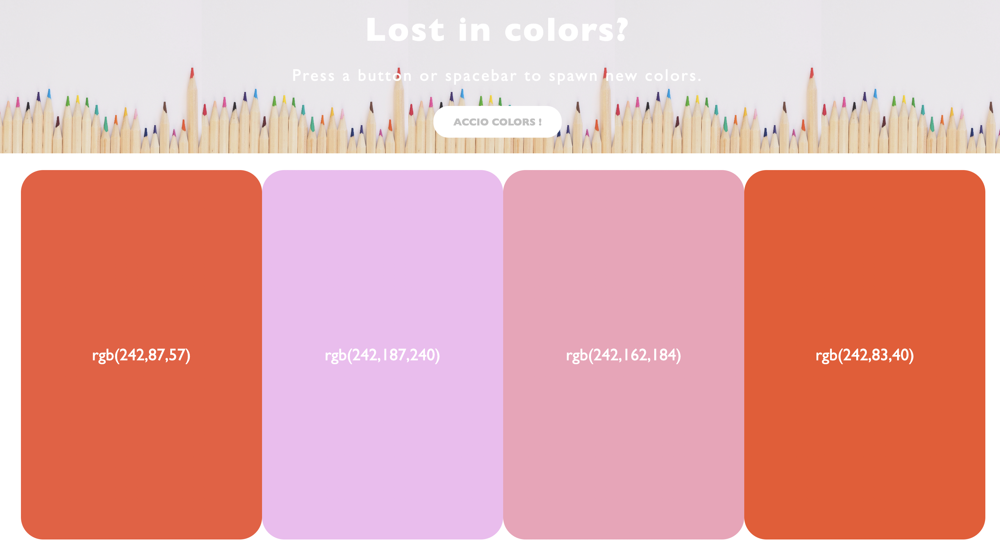
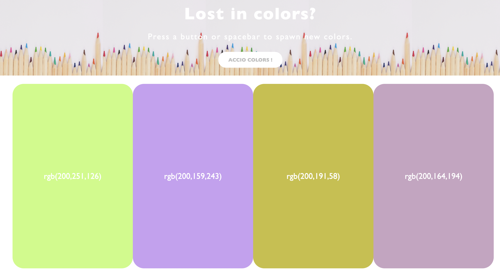
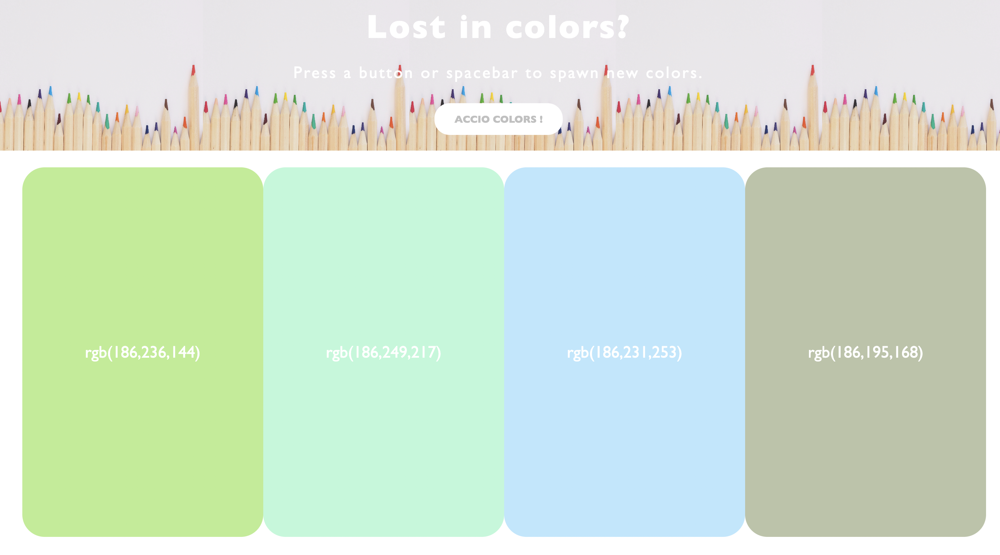

#   🎨  Color generation  🎨

## 🖌 What's it about?

Creating the websites or aplicattions, I always need a proper set of colors. As inspiration, I can use super simple Color Generator :D
It's my biggest JavaScript project that I've made so far. I'm so proud of it! ❤️  

## 🖌 First look 
An home page welcome us with fresh colors set,

clicking a button or any key it generates a new set,

all over again. :)

## 🖌 Technologies

+ HTML 5
+ CSS 3
+ JavaScript

## 🖌 Inspiration
This little project is part of an amazing Full Stack Developer Course created by  ♥ Ania Kubow ♥. Love this women, her sense of humor and ability to explain hard, code-things in a way that I finally understand. 🏆
You can check this course [here](https://www.codewithania.com/about) and I absolutely encourage You to visit her [YouTube](https://www.youtube.com/@AniaKubow) channel. :)
